# Ximbra — Sistema de Alertas de Tormentas Eléctricas

Sistema de predicción y alerta temprana de tormentas eléctricas para Perú, basado en IA y datos meteorológicos en tiempo real. Combina una plataforma multi-tenant SaaS con un pipeline de Machine Learning de extremo a extremo.

---

## Índice

1. [Visión general](#visión-general)
2. [Arquitectura del sistema](#arquitectura-del-sistema)
3. [Pipeline de datos e IA](#pipeline-de-datos-e-ia)
4. [Módulo de Campo — GPS, MQTT y alertas móviles](#módulo-de-campo--gps-mqtt-y-alertas-móviles)
5. [Stack tecnológico](#stack-tecnológico)
6. [Servicios y contenedores](#servicios-y-contenedores)
7. [Modelos de datos](#modelos-de-datos)
8. [API REST — endpoints](#api-rest--endpoints)
9. [FastAPI — validación y rate limiting](#fastapi--validación-y-rate-limiting)
10. [Frontend](#frontend)
11. [App móvil Flutter](#app-móvil-flutter)
12. [Variables de entorno](#variables-de-entorno)
13. [Despliegue en producción](#despliegue-en-producción)
14. [Configuración de estaciones](#configuración-de-estaciones)

---

## Visión general

Ximbra ingiere variables meteorológicas horarias de la API pública **Open-Meteo**, las procesa con modelos de red neuronal (**MLP / LSTM**) calibrados con Platt Scaling, genera alertas de tormenta según la escala SENAMHI (Verde / Amarillo / Naranja / Rojo) y las distribuye a través de un dashboard web, un bot de Telegram y, desde la v0.12, una app móvil de campo con rastreo GPS y zumbido de alerta.

> **¿Ximbra usa LLMs (modelos de lenguaje tipo GPT/Claude)?** No. Los "modelos de IA" de Ximbra son redes neuronales numéricas pequeñas (MLP/LSTM, descritas en detalle en [Pipeline de datos e IA](#pipeline-de-datos-e-ia)) que reciben 5 variables meteorológicas y devuelven una probabilidad de tormenta entre 0 y 1. No generan texto, no conversan, no son modelos de lenguaje — son clasificadores entrenados con datos históricos de Open-Meteo. No hay ningún LLM ni API de OpenAI/Anthropic en el stack de predicción.

La plataforma es multi-tenant con aislamiento lógico: múltiples organizaciones comparten la misma base de datos con separación por software.

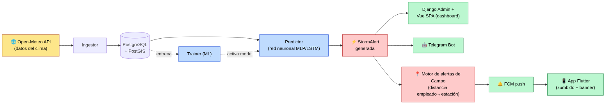

El módulo de Campo añade un segundo flujo de datos, independiente del meteorológico: dispositivos móviles de trabajadores envían su posición GPS por MQTT en tiempo real, y un motor calcula su distancia a la estación con alerta activa más cercana para decidir si deben recibir una notificación push con zumbido. Ver el detalle completo en [Módulo de Campo](#módulo-de-campo--gps-mqtt-y-alertas-móviles).

---

## Arquitectura del sistema

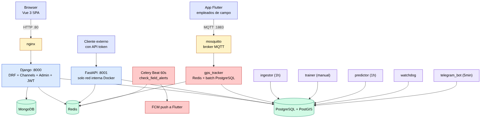

> FastAPI nunca pasa por nginx ni se expone públicamente — solo lo alcanzan clientes con un API token dentro de la red interna de Docker.

---

## Pipeline de datos e IA

### Fuente de datos: Open-Meteo

Variables meteorológicas obtenidas por coordenadas (lat/lon) de cada estación:

| Variable | Descripción | Uso |
|---|---|---|
| `temperature_2m` | Temperatura superficial (°C) | Feature directo |
| `relative_humidity_2m` | Humedad relativa (%) | Feature directo |
| `surface_pressure` | Presión atmosférica (hPa) | Feature directo |
| `cape` | Energía convectiva disponible (J/kg) | Feature crítico |
| `temperature_850/700/500hPa` | Temperatura por niveles de presión | Para K-Index |
| `relative_humidity_850/700hPa` | Humedad por niveles de presión | Para K-Index |

**K-Index** se calcula internamente a partir de niveles de presión:
```
K-Index = (T850 - T500) + Td850 - (T700 - Td700)
Td ≈ T - (100 - RH) / 5   [aproximación Magnus, válida para RH > 50%]
```

- **Tiempo real** (`ingestor`): `api.open-meteo.com/v1/forecast` — últimas 24h + próximas 24h
- **Histórico** (`trainer`): `archive-api.open-meteo.com/v1/archive` — desde 1940 hasta ~5 días atrás

### CRISP-DM — Fases del pipeline ML

Metodología estándar de proyectos de Machine Learning, en 6 fases que van de "qué problema resolvemos" a "el modelo ya está prediciendo en producción":

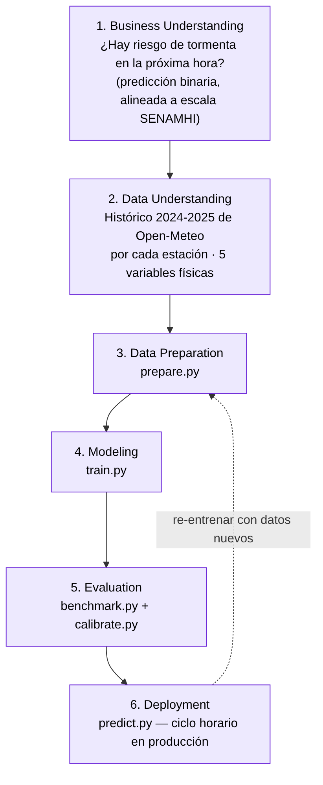

**[3] Data Preparation** — limpieza y normalización antes de entrenar:
- Quita valores fuera de rango físico: temperatura (-20, 50°C), humedad (0-100%), presión (500-1100 hPa), CAPE (0-10000 J/kg), K-Index (-20, 60)
- Etiqueta cada fila como tormenta o no, con una regla simple: `CAPE ≥ 500 J/kg AND K-Index ≥ 20 → storm = 1`
- Normaliza los valores a escala 0-1 (`MinMaxScaler`, se guarda como `scaler.pkl` para usar el mismo criterio en producción)
- Divide los datos: 70% para entrenar, 15% para validar, 15% para probar al final

**[4] Modeling** — se entrenan dos arquitecturas distintas y se comparan:

**MLP** — ve solo el momento actual:

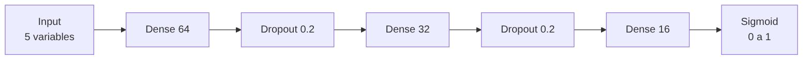

**LSTM** — ve las últimas 6 horas, con memoria:

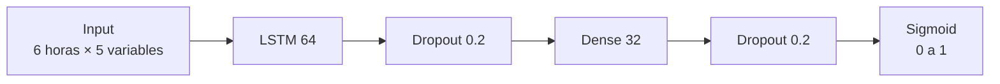

Ambas usan optimizador Adam (lr=0.001), pérdida `binary_crossentropy`, `EarlyStopping` (para 50 épocas máx., se detiene si no mejora en 8 épocas), batch=64. Al final se comparan por ROC-AUC y **gana la arquitectura que prediga mejor** — no es una decisión manual.

**[5] Evaluation** — antes de pasar a producción:
- Validación cruzada por folds (`ModelBenchmark`)
- Calibración de probabilidades con Platt Scaling — para que "0.8" realmente signifique "80% de las veces que el modelo dice esto, hay tormenta"
- SHAP: explica qué variable pesó más en cada predicción individual (ej. "fue el CAPE alto")
- Umbrales de corte (verde/amarillo/naranja/rojo) ajustados automáticamente con el estadístico de Youden
- Se guardan en disco: el modelo (`.keras`), el normalizador (`scaler.pkl`), el calibrador (`calibrator.pkl`) y el set de referencia de SHAP

**[6] Deployment** — esto es lo que corre cada hora en producción (`predictor`):

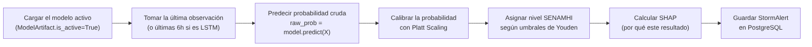

### Escala de alertas SENAMHI

| Nivel | Color | Umbral prob. (default) | Significado |
|---|---|---|---|
| 1 | 🟢 Verde | < 0.30 | Sin riesgo |
| 2 | 🟡 Amarillo | 0.30 – 0.60 | Riesgo moderado |
| 3 | 🟠 Naranja | 0.60 – 0.85 | Peligroso |
| 4 | 🔴 Rojo | ≥ 0.85 | Riesgo extremo |

Los umbrales se ajustan automáticamente por Youden's J tras la calibración y se persisten en `ModelArtifact.thresholds_json`.

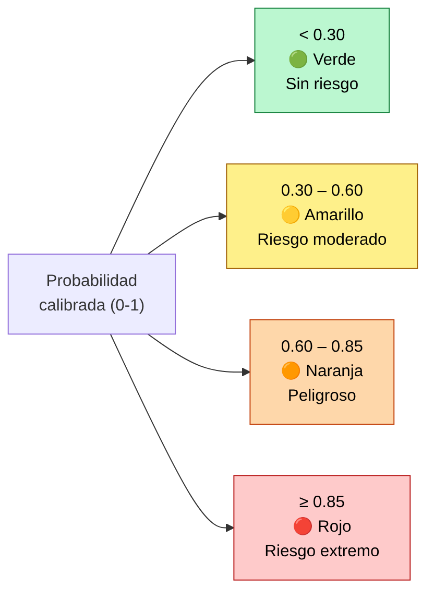

### Flujo de notificación

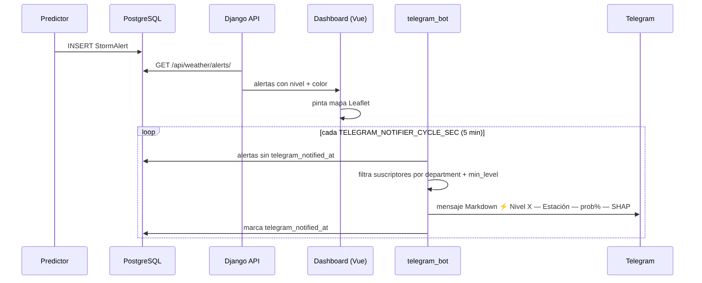

---

## Módulo de Campo — GPS, MQTT y alertas móviles

Desde la v0.12 (junio 2026), Ximbra incorpora un segundo sistema completo pensado para trabajadores que están físicamente en el campo (obras, frentes de trabajo) y necesitan saber, en tiempo real, si una tormenta eléctrica se está acercando a su posición exacta — no solo a la estación meteorológica más cercana.

Este módulo vive en la app `backend/apps/field/`, un servicio Python independiente (`gps_tracker/`), un broker MQTT (`mosquitto`) y una app móvil Flutter (`mobile/`). Es completamente separado del pipeline de IA: no usa redes neuronales, usa geometría simple (distancia) sobre datos que ya generó el predictor.

### ¿Para qué sirve, en palabras simples?

1. Cada empleado de campo lleva el celular con la app Ximbra abierta.
2. El celular manda su ubicación GPS cada 30 segundos a un servidor.
3. Cada 60 segundos, el servidor calcula qué tan lejos está cada empleado de la estación meteorológica más cercana que tiene una alerta de tormenta activa.
4. Si está a menos de 16 km → se le manda una notificación push con zumbido continuo (peligro inmediato, "busca refugio ahora").
5. Si está entre 16 y 32 km → notificación con zumbido intermitente (alerta, mantente atento).
6. Si está más lejos, no recibe nada.
7. Además, el empleado puede ver en su celular un mapa con los puntos de refugio fijos más cercanos (cuevas, casetas, contenedores) ordenados por distancia.

### Modelos de datos del módulo (`backend/apps/field/models.py`)

| Modelo | Qué representa | Campos clave |
|---|---|---|
| `Employee` | Un trabajador de campo. **No** necesariamente tiene cuenta de usuario del sistema — solo necesita el celular con la app. | `full_name`, `document_number`, `device_id` (único, para MQTT), `fcm_token` (para el push), `photo`, `last_alert_level`, `last_alert_sent_at` |
| `Project` | Una obra o proyecto donde trabajan los empleados. | `name`, `start_date`/`end_date`, M2M con `Employee` |
| `GeoFence` | Un "frente de trabajo": un polígono dibujado en el mapa que delimita dónde trabaja un proyecto. | `perimeter` (PolygonField geográfico), FK a `Project` |
| `MobileRefuge` | Una unidad móvil (camioneta, bus) que sirve de refugio. Su posición es la del conductor — no lleva GPS propio, usa el celular del conductor (que es un `Employee`). | `code`, `plate`, `capacity`, `conductor` (FK a Employee) |
| `EmployeePosition` | El histórico de posiciones GPS — una fila por cada posición recibida (no en tiempo real, esto es para reportes/auditoría). | `entity_id`, `entity_type`, `latitude`, `longitude`, `recorded_at` |
| `RefugePoint` | Un punto de refugio fijo (caseta, edificio) marcado en el mapa. | `location` (PointField geográfico), `capacity`, FK a `Project` |

La posición **en vivo** (la de "ahora mismo") no se guarda en PostgreSQL para cada mensaje — eso sería demasiado tráfico a la base de datos. Se guarda en **Redis**, que es mucho más rápido, y solo se escribe en PostgreSQL en lotes (ver siguiente sección).

### De dónde vienen los datos GPS, cuándo y cómo se ingieren

A diferencia del clima (que viene de una API externa, Open-Meteo), los datos de posición GPS vienen de los **propios celulares de los empleados** — son datos generados por el sistema mismo, no una fuente externa. El flujo es:

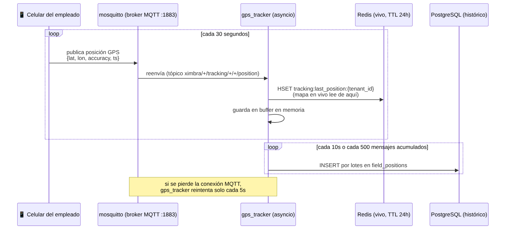

**Tópico MQTT:** `ximbra/{tenant_id}/tracking/employee/{employee_id}/position` — cada celular publica solo a su propio tópico; `gps_tracker` está suscrito al patrón `ximbra/+/tracking/+/+/position` (el `+` es un comodín MQTT) para recibir todos a la vez.

**Resumen para quien no es técnico:** los datos GPS no se "descargan" de ningún sitio externo como el clima — se reciben en tiempo real de cada celular conectado, se guardan al instante en una memoria rápida (Redis) para el mapa en vivo, y cada 10 segundos se respaldan en lote en la base de datos permanente para no perderlos.

### Motor de alertas por distancia (`backend/apps/field/tasks.py`)

Esta es la tarea Celery `field.check_field_alerts`, programada para correr **cada 60 segundos** (`CELERY_BEAT_SCHEDULE`). Es completamente independiente del modelo de IA — no predice nada nuevo, solo usa las alertas (`StormAlert`) que el `predictor` ya generó y calcula geometría:

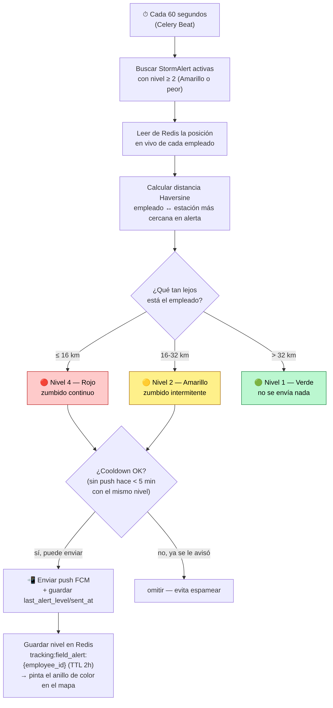

### Notificaciones push (FCM) — `backend/apps/field/fcm.py`

Se usa **Firebase Cloud Messaging** (Google) para enviar las notificaciones push al celular, vía la librería `firebase-admin`. La credencial de servicio se configura una sola vez en `.env` (`FIREBASE_CREDENTIALS_JSON`, el JSON de cuenta de servicio que se descarga desde Firebase Console). Si esa variable no está configurada, el sistema simplemente no envía push (no falla) — útil para ambientes de desarrollo sin Firebase configurado.

### Vista en vivo para el dashboard — `TrackingLiveView`

El endpoint `GET /api/field/tracking/live/` lee directamente de Redis (no de PostgreSQL, para que sea instantáneo) las últimas posiciones de todos los empleados y refugios móviles del tenant activo, las enriquece con el nombre del empleado y el nivel de alerta actual, y las entrega al frontend. El mapa Vue (`TrackingMap.vue` / `SafetyMap.vue`) hace polling a este endpoint cada 5 segundos.

---

## Stack tecnológico

### Backend

| Tecnología | Versión | Rol |
|---|---|---|
| Python | 3.12 | Runtime |
| Django | 5.1.4 | API REST, Admin, WebSockets, ORM |
| Django REST Framework | 3.15.2 | Serializers, ViewSets, permisos |
| Django Unfold | 0.34.0 | Admin moderno |
| djangorestframework-simplejwt | 5.5.0 | JWT (access + refresh + blacklist) |
| Django Channels | 4.2.0 | WebSockets |
| GeoDjango + PostGIS | — | Estaciones con coordenadas geoespaciales |
| Celery | 5.4.0 | Tareas async (emails, jobs) |
| django-celery-beat | 2.7.0 | Scheduler tareas periódicas |
| django-split-settings | — | Settings modulares (base/dev/prod/testing) |
| FastAPI | 0.115.6 | Validación tokens + rate limiting |
| uvicorn | — | ASGI para Django async y FastAPI |
| gunicorn + UvicornWorker | — | Servidor producción Django |
| firebase-admin | 6.6.0 | Envío de notificaciones push (FCM) a la app móvil |

### Módulo de Campo (GPS / MQTT)

| Tecnología | Versión | Rol |
|---|---|---|
| Eclipse Mosquitto | 2 | Broker MQTT — recibe posiciones GPS de los celulares |
| aiomqtt | 2.3.0 | Cliente MQTT asíncrono (servicio `gps_tracker`) |
| asyncpg | 0.29.0 | Cliente PostgreSQL asíncrono para batch insert de posiciones |
| redis (asyncio) | 5.2.1 | Lectura/escritura de posiciones en vivo |

### Machine Learning

| Tecnología | Versión | Rol |
|---|---|---|
| TensorFlow / Keras | 2.17.0 | Modelos MLP y LSTM |
| scikit-learn | 1.5.2 | MinMaxScaler, Platt Scaling, métricas |
| XGBoost | 2.0.3 | Modelo alternativo para benchmark |
| SHAP | 0.46.0 | Explicabilidad DeepExplainer por predicción |
| pandas | 2.2.3 | Preparación del dataset |
| numpy | 1.26.4 | Arrays y operaciones numéricas |
| joblib | 1.4.2 | Persistencia scaler, calibrador, SHAP background |
| httpx | 0.27.2 | Cliente HTTP async para Open-Meteo |

### Frontend

| Tecnología | Versión | Rol |
|---|---|---|
| Vue.js | 3.5.13 | SPA, Composition API |
| Pinia | 2.3.0 | Estado global (auth, tenant, config) |
| Vue Router | — | Guards de autenticación, rutas protegidas |
| TailwindCSS | 3.4.17 | Estilos utility-first |
| Axios | — | HTTP con interceptors JWT (refresh automático) |
| Leaflet | — | Mapa interactivo de estaciones y alertas |

### Infraestructura

| Servicio | Imagen | Puerto |
|---|---|---|
| PostgreSQL + PostGIS | `postgis/postgis:16-3.4` | 5432 |
| Redis | `redis:7-alpine` | 6379 |
| MongoDB | `mongo:4.4` | 27017 |
| MinIO | `minio/minio:latest` | 9000 (S3), 9001 (console) |
| nginx | `nginx:alpine` (build) | **80** (público) |
| Django | Python 3.12 (build) | interno |
| FastAPI | Python 3.12 (build) | 8001 (interno) |
| Mosquitto (MQTT) | `eclipse-mosquitto:2` | **1883** (público — celulares de campo) |
| gps_tracker | Python 3.12 (build) | interno (sin puertos expuestos) |

---

## Servicios y contenedores

Todos los contenedores comparten la red Docker `ximbra_app_network` (bridge):

| Grupo | Contenedor | Rol |
|---|---|---|
| 🌐 Web | `vue` | nginx — SPA compilada, proxy `/api/` → `django:8000` |
| 🌐 Web | `django` | gunicorn + UvicornWorker |
| 🌐 Web | `celery_worker` | tareas async |
| 🌐 Web | `celery_beat` | scheduler periódico |
| 🌐 Web | `apiauth` | FastAPI — tokens + rate limit |
| 💾 Datos | `postgres` | PostGIS |
| 💾 Datos | `redis` | broker / caché / pub-sub |
| 💾 Datos | `mongodb` | documentos |
| 💾 Datos | `minio` | object storage |
| 💾 Datos | `minio_init` | one-shot — crea el bucket |
| 🧠 IA/Clima | `ingestor` | ciclo 1h — Open-Meteo → PostgreSQL |
| 🧠 IA/Clima | `predictor` | ciclo 1h — modelo activo → StormAlert |
| 🧠 IA/Clima | `trainer` | one-shot manual — entrena MLP/LSTM |
| 🧠 IA/Clima | `watchdog` | ciclo continuo — heartbeats Redis |
| 🧠 IA/Clima | `telegram_bot` | ciclo 5 min |
| 📍 Campo | `mosquitto` | broker MQTT — único puerto de campo expuesto |
| 📍 Campo | `gps_tracker` | ciclo continuo — MQTT → Redis + PostgreSQL |

celery_beat también dispara `field.check_field_alerts` cada 60 segundos (motor de distancia del módulo de Campo, ver sección dedicada).

### Ciclos temporales configurables

| Servicio | Variable de entorno | Default |
|---|---|---|
| ingestor | `INGESTOR_CYCLE_SEC` | 3600 (1h) |
| predictor | `PREDICTOR_CYCLE_SEC` | 3600 (1h) |
| telegram_bot | `TELEGRAM_NOTIFIER_CYCLE_SEC` | 300 (5 min) |
| gps_tracker (batch a PostgreSQL) | `BATCH_INTERVAL_SEC` | 10 s (o cada 500 mensajes) |
| field.check_field_alerts (Celery Beat) | fijo en código | 60 s |
| App Flutter (publicación GPS) | `publishIntervalSec` (app_config.dart) | 30 s |

---

## Modelos de datos

### Multi-tenancy y autenticación

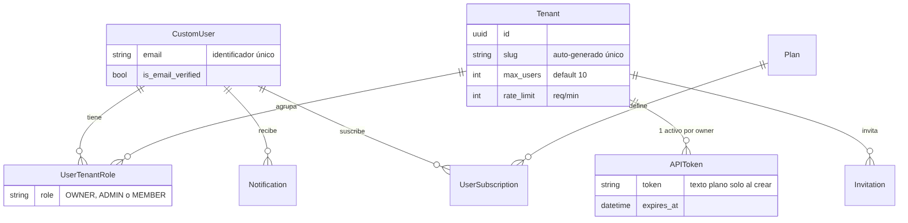

#### CustomUser
| Campo | Tipo | Descripción |
|---|---|---|
| `email` | EmailField unique | Identificador (no username) |
| `is_email_verified` | Boolean | Verificación requerida para operar |
| `email_verification_token` | CharField(64) | Token de verificación |
| `password_reset_token` | CharField(64) | Token para reset |
| `is_active / is_staff / is_superuser` | Boolean | Control de acceso |

#### Tenant
| Campo | Tipo | Descripción |
|---|---|---|
| `id` | UUID | PK |
| `name / slug` | CharField | Slug auto-generado con unicidad garantizada |
| `is_active` | Boolean | Habilitar/deshabilitar tenant |
| `max_users` | PositiveInt | Límite de miembros (default 10) |
| `rate_limit` | PositiveInt | Requests/minuto para API tokens |

#### APIToken
| Campo | Tipo | Descripción |
|---|---|---|
| `token` | CharField | Mostrado en texto plano solo al crear |
| `tenant / owner` | FK | Propietario y tenant asociado |
| `expires_at` | DateTime | Expiración configurable |
| `last_used_at` | DateTime | Tracking de último uso |
| `is_active` | Boolean | Máximo 1 activo por tenant/owner |

### Meteorología y ML

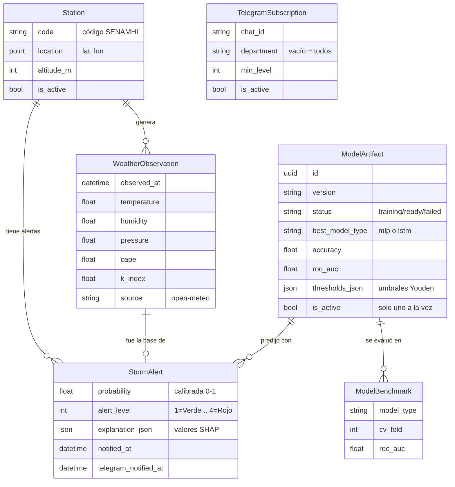

### Módulo de Campo (`apps/field/`)

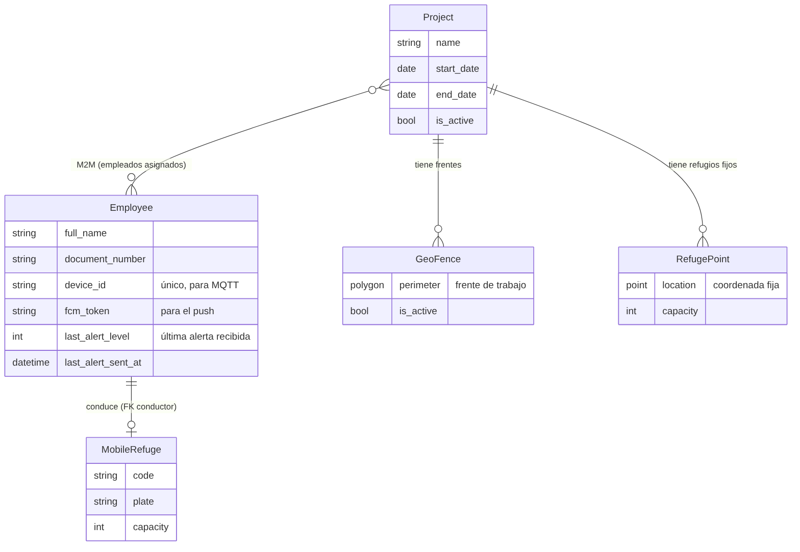

`EmployeePosition` es aparte: una fila por cada mensaje GPS recibido (`entity_id`, `entity_type`, `latitude`, `longitude`, `accuracy`, `recorded_at`) — solo para histórico/auditoría, no para el mapa en vivo.

**En Redis** (no es tabla, vive en memoria):
- `tracking:last_position:{tenant_id}` → última posición de cada entidad (TTL 24h) — esto alimenta el mapa en vivo
- `tracking:field_alert:{employee_id}` → nivel de alerta actual de ese empleado (TTL 2h) — esto pinta el anillo de color en el mapa

### Notificaciones y plataforma

```
Notification (per-user, no filtrada por tenant)
    tipos: rate_limit_exceeded · tenant_invitation · member_role_changed
           api_token_expiring · system_alert

Jobs (Celery via django-celery-beat)
    task_id · state · result · tenant · created_at
```

---

## API REST — endpoints

Base: `http://<host>/api/`  (nginx hace proxy a django:8000 internamente)

### Autenticación (`/api/users/`)

| Método | Endpoint | Descripción |
|---|---|---|
| POST | `login/` | JWT login — retorna access + refresh token |
| POST | `register/` | Registro — envía email de verificación via Celery |
| POST | `refresh/` | Renovar access token con refresh token |
| POST | `logout/` | Blacklist del refresh token |
| POST | `verify-email/` | Verificar email con token recibido |
| POST | `forgot-password/` | Solicitar reset de contraseña |
| POST | `reset-password/` | Confirmar nuevo password con token |
| POST | `change-password/` | Cambiar password (autenticado) |
| POST | `select-tenant/` | Activar tenant en sesión JWT |
| GET/PUT | `me/` | Perfil del usuario autenticado |
| POST | `invitations/` | Crear y enviar invitación por email |
| GET | `invitations/list/` | Listar invitaciones del tenant activo |
| GET/POST | `invitations/<token>/` | Validar / aceptar invitación |
| GET | `list/` | Listar usuarios (admin/superadmin) |
| POST | `<pk>/toggle/` | Activar o desactivar usuario |

### Tenants (`/api/tenants/`)

CRUD completo. Acceso filtrado por rol: Owner ve configuración completa, Member ve solo datos.

### API Tokens (`/api/tokens/`)

Generación, rotación y revocación. El token se muestra una sola vez al crear.

### Jobs Celery (`/api/jobs/`)

| Método | Endpoint | Descripción |
|---|---|---|
| GET | `` | Listar tareas del tenant activo |
| POST | `dispatch/` | Despachar tarea Celery personalizada |
| GET | `<task_id>/` | Estado y resultado de la tarea |

### Clima y alertas (`/api/weather/`)

| Método | Endpoint | Descripción |
|---|---|---|
| GET | `stations/` | Lista de estaciones activas |
| GET | `stations/geojson/` | Estaciones en GeoJSON para Leaflet |
| GET | `observations/` | Observaciones meteorológicas recientes |
| GET | `alerts/` | Alertas activas con probabilidad y nivel |
| GET | `alerts/geojson/` | Alertas en GeoJSON con color SENAMHI |
| GET | `telegram/subscriptions/` | Suscripciones Telegram activas |

### Campo — GPS y alertas móviles (`/api/field/`)

Todos los endpoints CRUD requieren JWT y filtran automáticamente por el tenant activo.

| Método | Endpoint | Descripción |
|---|---|---|
| GET/POST | `employees/` | CRUD de empleados de campo |
| POST | `employees/<id>/toggle/` | Activar/desactivar empleado |
| GET/POST | `projects/` | CRUD de proyectos/obras |
| POST | `projects/<id>/toggle/` | Activar/desactivar proyecto |
| POST | `projects/<id>/assign_employees/` | Asignar empleados a un proyecto |
| GET/POST | `fences/` | CRUD de frentes de trabajo (polígonos) |
| GET | `fences/geojson/` | Frentes activos en GeoJSON para Leaflet |
| GET/POST | `refuges/` | CRUD de unidades de refugio móvil |
| POST | `refuges/<id>/toggle/` | Activar/desactivar unidad |
| GET/POST | `points/` | CRUD de puntos de refugio fijo |
| GET | `points/geojson/` | Puntos activos en GeoJSON (usado también por la app móvil) |
| GET | `tracking/live/` | Posiciones en vivo (desde Redis) de empleados y refugios móviles, con nivel de alerta actual |

### Sistema y plataforma

| Método | Endpoint | Descripción |
|---|---|---|
| GET | `/health/` | Health check del backend |
| GET | `/api/config/` | Configuración pública (SINGLE_TENANT_MODE, etc.) |
| GET | `/api/config/site/` | Branding y nombre del sitio |
| GET | `/api/plans/me/` | Plan de suscripción activo |
| GET | `/api/plans/usage/` | Uso actual vs. límites del plan |
| GET | `/api/dashboard/` | Widgets del dashboard (rate limit, historial) |
| GET | `/api/watchdog/` | Estado de los servicios vía heartbeats |
| GET/PATCH | `/api/notifications/` | Listar, leer y limpiar notificaciones |

---

## FastAPI — validación y rate limiting

Servicio en puerto **8001** (solo red interna Docker, nunca expuesto al exterior).

### Arquitectura hexagonal

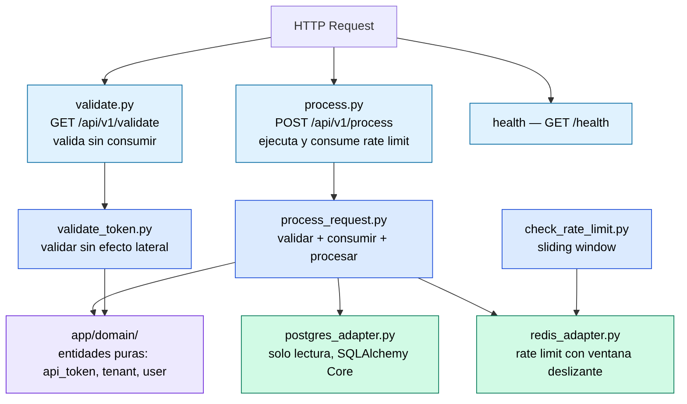

Capas, de afuera hacia adentro: **rutas** (entrada HTTP) → **casos de uso** (`app/application/`) → **dominio** (entidades puras, sin dependencias) y **adaptadores de infraestructura** (`app/infrastructure/`, hablan con PostgreSQL/Redis).

**Headers aceptados:**
- `Authorization: Bearer <token>`
- `X-Api-Token: <token>`

**Respuesta `/api/v1/validate`:**
```json
{
  "valid": true,
  "tenant_id": "uuid",
  "tenant_name": "Ximbra",
  "user_email": "user@example.com",
  "role": "OWNER",
  "message": "Token válido"
}
```

---

## Frontend

SPA Vue 3 servida por nginx en puerto 80. Las peticiones API van a `/api/` (mismo origen) y nginx las proxea internamente a `django:8000`. No hay CORS cross-port.

### Rutas protegidas (requieren JWT)

| Ruta | Vista | Descripción |
|---|---|---|
| `/dashboard` | Dashboard.vue | Widgets: rate limit, salud de servicios, historial |
| `/profile` | Profile.vue | Perfil del usuario |
| `/tenants` | TenantList.vue | Tenants del usuario con roles |
| `/tenants/:slug` | TenantDetail.vue | Miembros, API token, configuración |
| `/tenants/:slug/settings` | TenantSettings.vue | Edición del tenant |
| `/jobs` | JobList.vue | Visor de tareas Celery |
| `/watchdog` | Watchdog.vue | Estado de servicios en tiempo real |
| `/weather/stations` | Stations.vue | Lista de estaciones con estado |
| `/weather/map` | StationMap.vue | Mapa Leaflet de estaciones |
| `/weather/alerts` | StormAlerts.vue | Alertas activas con mapa y colores SENAMHI |
| `/weather/telegram` | TelegramSubscriptions.vue | Gestión de suscripciones Telegram |
| `/admin/users` | UserManagement.vue | Gestión de usuarios (superadmin) |
| `/admin/settings` | SiteSettings.vue | Configuración del sitio |
| `/campo/empleados` | EmployeeList.vue | CRUD de empleados de campo |
| `/campo/proyectos` | ProjectList.vue | CRUD de proyectos/obras |
| `/campo/proyectos/:id` | ProjectDetail.vue | Detalle de proyecto + asignación de empleados |
| `/campo/frentes` | GeoFenceMap.vue | Dibujar/editar frentes de trabajo en mapa Leaflet |
| `/campo/refugios-moviles` | MobileRefugeList.vue | CRUD de unidades de refugio móvil |
| `/campo/rastreo` | TrackingMap.vue | Mapa en vivo de posiciones GPS + nivel de alerta |
| `/campo/refugios-fijos` | RefugePointMap.vue | Marcar puntos de refugio fijo en el mapa |
| `/campo/mapa-seguridad` | SafetyMap.vue | Vista integrada: frentes + refugios + GPS en vivo + estaciones + alertas |

### Rutas públicas

| Ruta | Vista |
|---|---|
| `/login` | Login.vue |
| `/register` | Register.vue |
| `/verify-email` | VerifyEmail.vue |
| `/forgot-password` | ForgotPassword.vue |
| `/reset-password` | ResetPassword.vue |
| `/invitations/:token` | AcceptInvitation.vue |

### Stores Pinia

| Store | Responsabilidad |
|---|---|
| `auth` | Login, logout, refresh automático, estado del usuario |
| `tenant` | Tenant activo, CRUD, selección de tenant |
| `config` | Configuración del sistema (SINGLE_TENANT_MODE, branding) |

### Composables clave

| Composable | Responsabilidad |
|---|---|
| `useAuth` | Guards de autenticación en el router |
| `useTenant` | Operaciones sobre el tenant activo |
| `useApiToken` | Generación y revocación de API tokens |
| `useNotifications` | Polling de notificaciones no leídas |
| `useHead` | Metadatos SEO dinámicos por ruta |

### Componentes de widgets (dashboard)

| Componente | Descripción |
|---|---|
| `RateLimitGauge.vue` | Gauge visual de uso del rate limit por tenant |
| `ServiceHealth.vue` | Estado de servicios vía heartbeats del watchdog |
| `UsageHistory.vue` | Historial de peticiones API del tenant |
| `NotificationBell.vue` | Badge con conteo de notificaciones no leídas |
| `ApiTokenWidget.vue` | Generación one-shot del API token (mostrado una vez) |
| `MemberList.vue` | Gestión de miembros con cambio de rol e invitaciones |

---

## App móvil Flutter

App nativa (`mobile/`) que usan los empleados de campo. No requiere usuario del sistema (Django), solo un `employee_id` registrado por el administrador.

### Flujo de uso

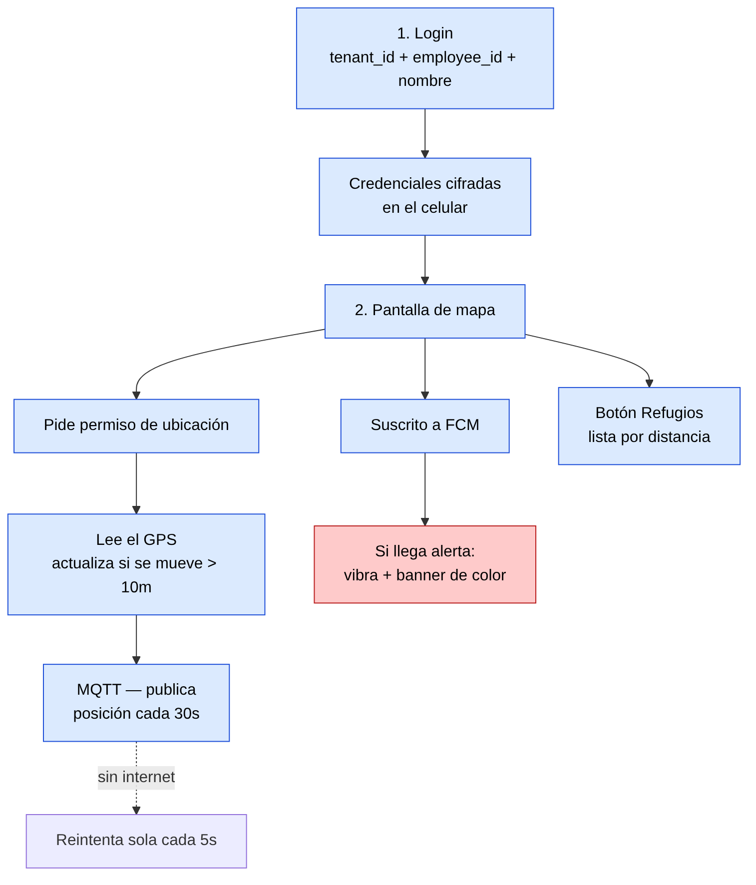

### Paquetes principales (`pubspec.yaml`)

| Paquete | Rol |
|---|---|
| `mqtt_client` | Publica la posición GPS por MQTT |
| `geolocator` | Lee el GPS del celular |
| `flutter_map` + `latlong2` | Mapa interactivo (sin depender de Google Maps) |
| `firebase_messaging` | Recibe las notificaciones push (FCM) |
| `vibration` | Activa el zumbido del celular según el nivel de alerta |
| `flutter_secure_storage` | Guarda las credenciales cifradas en el dispositivo |

> El servidor MQTT (`MQTT_HOST`) y el resto de configuración de conexión se definen en build-time en `mobile/lib/config/app_config.dart` — no requiere recompilar para apuntar a otro entorno si se usa `--dart-define`.

---

## Variables de entorno

Copia `.env.example` como `.env` y completa los valores antes de desplegar:

```bash
# ── Django ────────────────────────────────────
DJANGO_ENV=production
DJANGO_DEBUG=False
DJANGO_SECRET_KEY=<genera con get_random_secret_key()>
ALLOWED_HOSTS=<IP o dominio>
FRONTEND_URL=http://<IP o dominio>
CORS_ALLOWED_ORIGINS=http://<IP o dominio>

# ── Modo uni-tenant ───────────────────────────
SINGLE_TENANT_MODE=True          # False para multi-tenant
MAIN_TENANT_SLUG=ximbra

# ── PostgreSQL ────────────────────────────────
POSTGRES_DB=ximbra_db
POSTGRES_USER=ximbra_user
POSTGRES_PASSWORD=<password seguro>
POSTGRES_HOST=postgres
POSTGRES_PORT=5432

# ── Redis ─────────────────────────────────────
REDIS_PASSWORD=<password>
REDIS_URL=redis://:<password>@redis:6379
CELERY_BROKER_URL=redis://:<password>@redis:6379/0
CELERY_RESULT_BACKEND=redis://:<password>@redis:6379/0

# ── MongoDB ───────────────────────────────────
MONGODB_URI=mongodb://mongodb:27017
MONGODB_DB=ximbra_mongo

# ── MinIO (S3 local) ──────────────────────────
MINIO_ROOT_USER=<user>
MINIO_ROOT_PASSWORD=<password>
MINIO_BUCKET=ximbra
AWS_S3_ENDPOINT_URL=http://minio:9000

# ── FastAPI ───────────────────────────────────
FASTAPI_SECRET_KEY=<genera con secrets.token_hex(32)>
FASTAPI_ALGORITHM=HS256

# ── Telegram ──────────────────────────────────
TELEGRAM_BOT_TOKEN=<token de @BotFather>
TELEGRAM_NOTIFIER_CYCLE_SEC=300

# ── Ciclos de servicios ML ────────────────────
INGESTOR_CYCLE_SEC=3600
PREDICTOR_CYCLE_SEC=3600

# ── Firebase / FCM — alertas push a dispositivos de campo ─────
# JSON de cuenta de servicio de Firebase Console, en una sola línea.
# Si se deja vacío, el sistema simplemente no envía push (no falla).
FIREBASE_CREDENTIALS_JSON=

# ── MQTT Broker (Mosquitto) — rastreo GPS de campo ─────────────
MQTT_PORT=1883
```

---

## Despliegue en producción

### Requisitos

- Docker Engine + Docker Compose v2
- Servidor Linux (probado en Ubuntu/Debian)
- Puerto 80 accesible públicamente

### Primer despliegue

```bash
# 1. Clonar el repositorio en el servidor
git clone git@github.com:csotelo/cimbra.git /home/admin/ximbra
cd /home/admin/ximbra

# 2. Crear .env con los valores reales
cp .env.example .env
# editar .env

# 3. Construir y levantar todo el stack
docker compose up -d --build

# 4. Migraciones y superusuario inicial
docker compose exec django python manage.py migrate
docker compose exec django python manage.py createsuperuser

# 5. Cargar estaciones meteorológicas
docker compose exec django python manage.py seed_stations

# 6. Primer entrenamiento del modelo ML
docker compose run --rm trainer
```

### Flujo de datos completo en producción

**Flujo Clima/IA:**

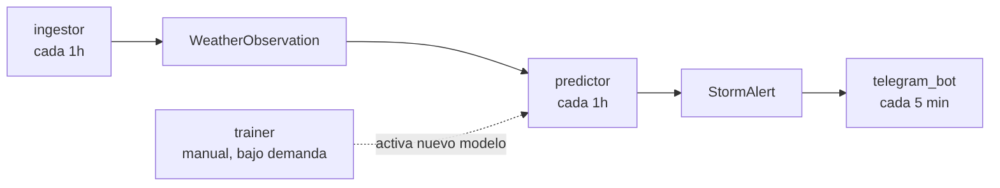

**Flujo Campo (paralelo e independiente del anterior):**

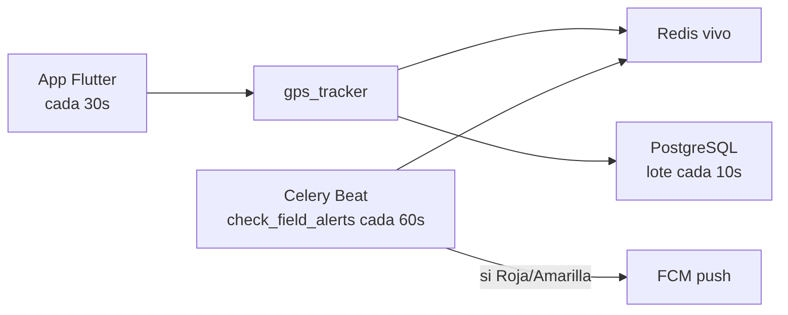

| Cuándo | Quién | Qué hace |
|---|---|---|
| Cada hora | `ingestor` | Open-Meteo forecast → `WeatherObservation` (upsert por estación+hora) |
| Cada hora | `predictor` | última(s) observación(es) → modelo activo → `StormAlert` |
| Cada 5 min | `telegram_bot` | `StormAlert` sin notificar → suscriptores de Telegram |
| Bajo demanda (manual) | `trainer` | Open-Meteo Archive histórico → nuevo `ModelArtifact` → se activa → `predictor` lo usa en el próximo ciclo |
| Continuo | App Flutter → MQTT | posición GPS cada 30s → `gps_tracker` → Redis (vivo) + PostgreSQL (lote cada 10s) |
| Cada 60s | Celery Beat | `field.check_field_alerts` — distancia a `StormAlert` activas → FCM push si está en zona Roja/Amarilla |

### Endpoints públicos en producción

| Recurso | URL |
|---|---|
| Frontend (SPA) | `http://<IP>/` |
| Django Admin | `http://<IP>/admin/` |
| MinIO Console | `http://<IP>:9001/` |
| FastAPI docs | Solo red interna — `http://apiauth:8001/docs` |

---

## Configuración de estaciones

Las estaciones se registran en Django Admin (`/admin/weather/station/`) o via management command. Cada estación requiere:

| Campo | Tipo | Descripción |
|---|---|---|
| `code` | CharField unique | Código SENAMHI (ej. `HUA001`) |
| `name` | CharField | Nombre de la estación |
| `department` | CharField | Departamento — usado para filtros Telegram |
| `location` | PointField (WGS84) | Coordenadas lat/lon para ingestor y mapa |
| `altitude_m` | Integer | Altitud en metros (opcional) |
| `is_active` | Boolean | Incluir en ciclos de ingestión y predicción |

El mapa del dashboard (`/weather/map`) muestra marcadores coloreados con el nivel de alerta activo más alto de cada estación.

---

## Versioning

`MAJOR.MINOR.PATCH` — fix → PATCH | feature → MINOR

Versión actual: **v0.15.1**

Changelog: [`CHANGELOG.md`](CHANGELOG.md)
